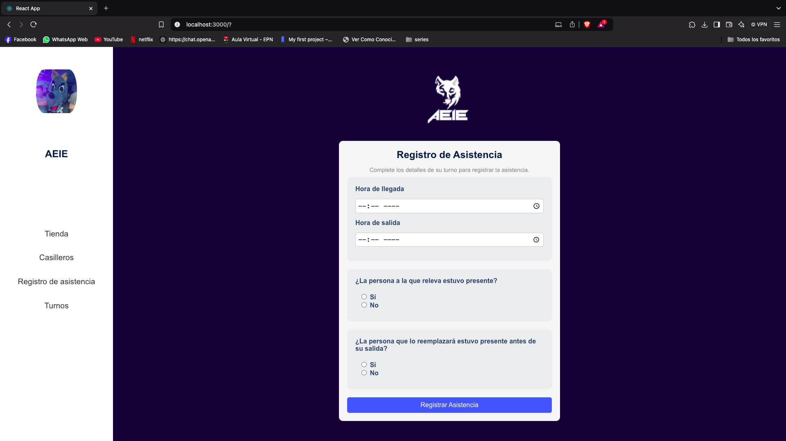

# AEIE Store and More - Interfaz de Registro de Asistencia

Este repositorio contiene el código para la segunda interfaz del proyecto **AEIE Store and More**, correspondiente a la tarea de la materia **Aplicaciones Web y Móviles**.

## Descripción

Esta interfaz representa el **Registro de Asistencia**, tal como se muestra en el mockup del proyecto **AEIE Store and More**. Los usuarios pueden ingresar la hora de llegada y salida, así como indicar si las personas de relevo estuvieron presentes en sus respectivos turnos.

## Captura de pantalla

A continuación, una muestra visual de la interfaz:

## Estructura de Componentes

- **App**: Componente principal que incluye `ItemSidebar` e `ItemRegistroAsistencia`.
- **ItemSidebar**: Componente de la barra lateral con enlaces a otras secciones del proyecto.
- **ItemRegistroAsistencia**: Componente central que contiene el formulario para el registro de asistencia.

## Tecnologías Utilizadas

- **React**: Para la construcción de la interfaz de usuario.
- **CSS**: Para el diseño y estilo de la interfaz.

## Instrucciones de Uso

1. Clona el repositorio en tu máquina local.
2. Instala las dependencias con `npm install`.
3. Inicia la aplicación con `npm start`.
4. La interfaz estará disponible en `http://localhost:3000`.